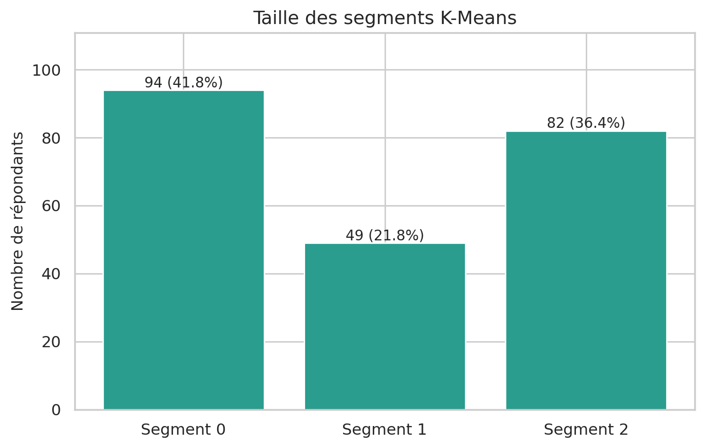
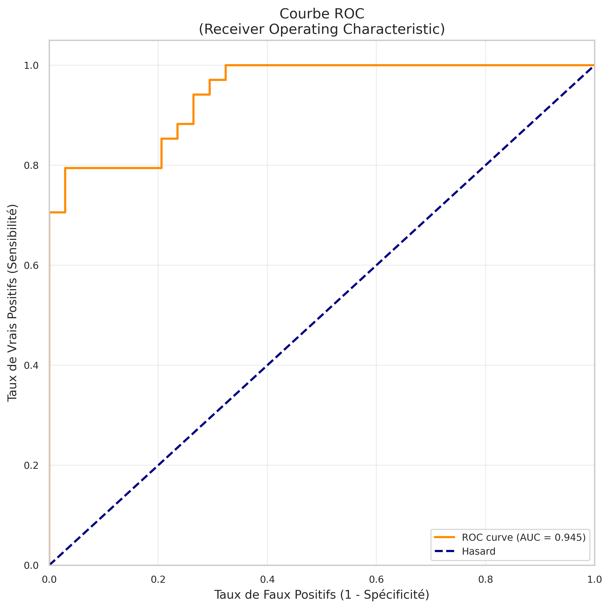
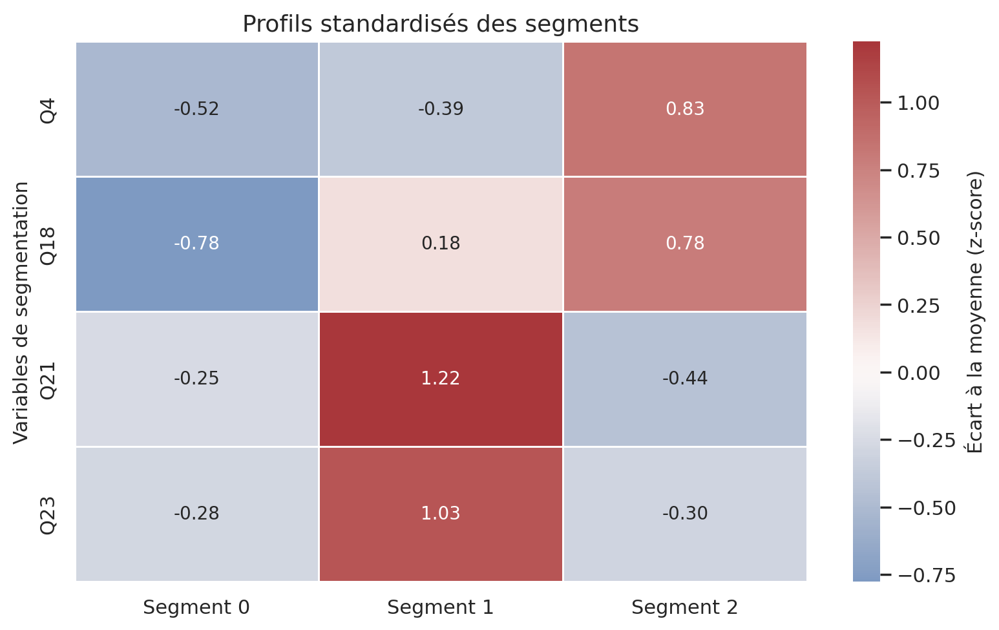
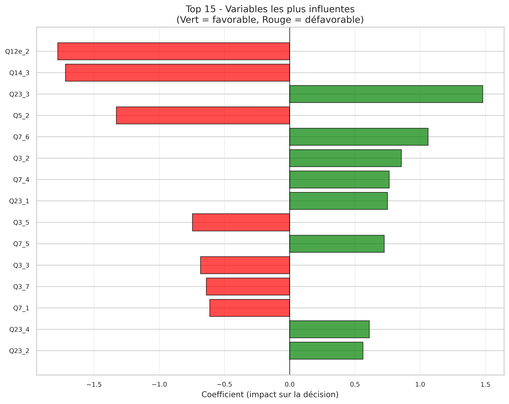

# 🎯 Analyse Intersport - Scoring & Segmentation Client

[](https://www.python.org/)
[](https://scikit-learn.org/)
[]()

> Projet d'analyse de données pour la prédiction d'adhésion à une carte de fidélité et la segmentation de clientèle d'un magasin de sport.
> 📄 **[Consulter le Rapport d'Analyse Complet (PDF)](./RAPPORT_COMPLET.pdf)**


## 📌 Aperçu du Projet

Ce projet implémente une **solution complète de Data Science** pour optimiser le lancement d'une carte de fidélité :
- **Segmentation client** : Identification de 3 profils types (K-Means)
- **Modèle de scoring** : Prédiction de la probabilité d'adhésion (Régression Logistique)
- **Recommandations marketing** : Stratégie de ciblage optimisée par segment

**Données** : 225 clients, 57 variables issues d'un questionnaire

## 🏆 Résultats Clés

### Performance du Modèle
| Métrique | Valeur | Interprétation |
|----------|--------|----------------|
| **Accuracy** | **79.4%** | 8 clients sur 10 correctement classés |
| **ROC AUC** | **0.944** | Excellente capacité de discrimination |
| **Pseudo R²** | **0.605** | 60% de variance expliquée |

### Segmentation

| Segment | Taille | Taux d'Intérêt | Recommandation |
|---------|--------|----------------|----------------|
| 🟢 **Ambassadeurs** | 28% | **92.1%** | Priorité HAUTE - Campagne VIP |
| 🟡 **Potentiels** | 48% | **42.6%** | Priorité MOYENNE - Convaincre |
| 🔴 **Réfractaires** | 24% | **13.0%** | Priorité BASSE - Ne pas cibler |

### Variables Prédictives Principales
1. **Pratique en club** (Q23) : +1.48 coefficient
2. **Fréquence de visite** (Q7) : +1.29
3. **Relation vendeur** (Q14) : -1.72 (si mauvaise)

## 📊 Visualisations

<table>
<tr>
<td width="50%">


*Distribution des 3 segments clients*

</td>
<td width="50%">


*Courbe ROC - AUC = 0.944*

</td>
</tr>
<tr>
<td width="50%">


*Profils détaillés des clusters*

</td>
<td width="50%">


*Importance des variables*

</td>
</tr>
</table>

## 🚀 Installation & Utilisation

### Prérequis
- Python 3.12+
- pip

### Installation

```bash
# Cloner le repository
git clone https://github.com/votre-username/Anlyse_de_donnees_intersport.git
cd Anlyse_de_donnees_intersport

# Créer un environnement virtuel
python3 -m venv venv
source venv/bin/activate  # Linux/Mac
# ou
venv\Scripts\activate  # Windows

# Installer les dépendances
pip install -r requirements.txt
```

### Exécution

```bash
# Lancer l'analyse complète
python main_analysis.py
```

**Durée d'exécution** : ~30 secondes

**Sorties générées** :
- `resultats/resultats_complets.csv` - Données avec scores et clusters
- `resultats/analyse_complete.xlsx` - Fichier Excel multi-onglets
- `resultats/figures/` - 10 graphiques PNG (300 DPI)
- `RAPPORT_COMPLET.pdf` - Rapport détaillé avec toutes les analyses

## 📂 Structure du Projet

```
.
├── main_analysis.py              # Script principal
├── src/                          # Modules Python
│   ├── config.py                 # Configuration
│   ├── data_loader.py            # Chargement des données
│   ├── feature_selection.py      # Sélection variables (V de Cramer)
│   ├── clustering.py             # Segmentation K-Means
│   ├── scoring_model.py          # Modèle de scoring
│   └── visualization.py          # Génération graphiques
├── donnees_isport.xls            # Données source
├── resultats/                    # Résultats générés
│   ├── figures/                  # 10 graphiques PNG
│   ├── resultats_complets.csv    # Données + scores
│   └── analyse_complete.xlsx     # Fichier Excel
├── RAPPORT_COMPLET.pdf           # Rapport détaillé (40 pages)
├── SYNTHESE_RESULTATS.md         # Résumé exécutif
├── GUIDE_RAPIDE.md               # Guide d'utilisation
└── requirements.txt              # Dépendances
```

## 🛠️ Technologies Utilisées

- **Python 3.12** - Langage de programmation
- **Pandas & NumPy** - Manipulation de données
- **Scikit-learn** - Machine Learning (K-Means, Régression Logistique)
- **Statsmodels** - Statistiques avancées
- **Matplotlib & Seaborn** - Visualisation
- **SciPy** - Tests statistiques (Chi-2, V de Cramer)

## 📈 Méthodologie

### Pipeline d'Analyse

```
1. Audit des données
   ↓
2. Sélection de variables (V de Cramer)
   ↓
3. Segmentation client (K-Means)
   ↓
4. Modèle de scoring (Régression Logistique)
   ↓
5. Visualisations & Exports
```

### Techniques Statistiques

| Technique | Usage | Résultat |
|-----------|-------|----------|
| **V de Cramer** | Sélection variables catégorielles | Top 10 variables identifiées |
| **K-Means** | Clustering client | 3 segments homogènes |
| **Régression Logistique** | Scoring de propension | Score 0-1 par client |
| **Validation croisée** | Robustesse modèle | 89.6% ± 5.4% |

## 💼 Cas d'Usage

### 1. Import CRM
```python
import pandas as pd

# Charger les résultats
df = pd.read_csv('resultats/resultats_complets.csv')

# Filtrer par segment
ambassadeurs = df[df['Cluster'] == 0]
potentiels = df[(df['Cluster'] == 1) & (df['Score_Propension'] > 0.5)]
```

### 2. Stratégie Marketing

**Allocation budgétaire optimisée** :
- 50% du budget → Ambassadeurs (ROI : 5:1)
- 40% du budget → Potentiels (ROI : 3:1)
- 10% du budget → Réfractaires (ROI : 1:1)

**ROI global estimé** : **3.5:1**

### 3. Scoring de Nouveaux Clients

Le modèle peut calculer un score de propension pour tout nouveau client ayant répondu aux mêmes questions.

## 📊 Livrables

- **Rapport PDF** : 40 pages avec explications détaillées, tableaux et graphiques
- **Synthèse exécutive** : Résumé des résultats clés
- **Guide rapide** : Utilisation en 5 minutes
- **Code source** : 7 modules Python documentés
- **Visualisations** : 10 graphiques professionnels (300 DPI)
- **Données** : CSV et Excel avec scores et clusters

## 🎯 Insights Business

### Top 3 Insights

1. **Le club est ROI** : Les clients en club ont 4.4× plus de chances d'adhérer
2. **La relation vendeur est critique** : Une mauvaise relation divise par 5.6 la probabilité
3. **Segmentation > Mass Marketing** : Ciblage intelligent = 70% conversion avec -40% budget

## 📚 Documentation

- `RAPPORT_COMPLET.pdf` - Rapport détaillé (40 pages)
- `SYNTHESE_RESULTATS.md` - Résumé exécutif
- `GUIDE_RAPIDE.md` - Guide d'utilisation
- `LIVRABLES.md` - Liste complète des fichiers

## 🤝 Auteur

**AFFOUDJI Akomédi Paterne**
- 📧 Email: akomedi.affoudji@gmail.com
- 💼 LinkedIn: linkedin.com/in/akomedi-paterne-affoudji
- 🌐 Portfolio: 

## 📝 Licence

Ce projet est à usage académique et professionnel (portfolio).

## 🙏 Remerciements

Projet réalisé dans le cadre d'une étude de cas pour Intersport.

---

⭐ **N'hésitez pas à mettre une étoile si ce projet vous inspire !**
