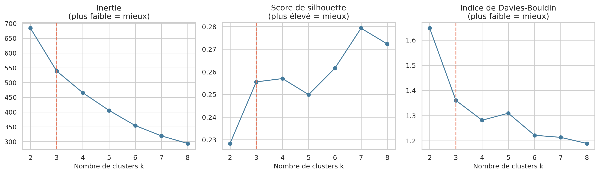
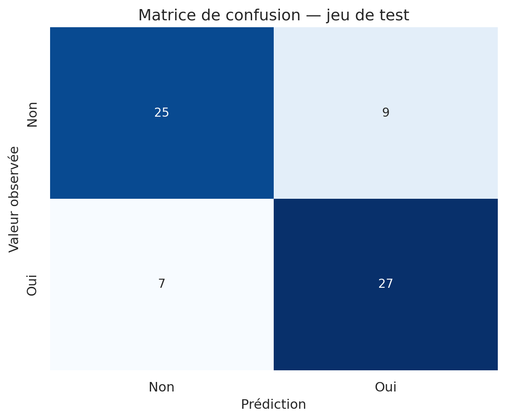

# Scoring et Segmentation Client — Étude de cas Retail


> **Projet académique / portfolio basé sur une étude de cas dans le secteur du retail sportif. Ce dépôt n'est pas affilié à Intersport.**

## Introduction

Cette étude exploite les réponses à un questionnaire sur les habitudes d'achat, la pratique sportive et l'intérêt déclaré pour une carte de fidélité. Elle traite séparément deux problématiques : comprendre des profils de clientèle par segmentation et construire un score d'intérêt par apprentissage supervisé.

Le projet privilégie une méthodologie simple et explicable. Il ne constitue ni une mission réalisée pour une enseigne, ni un modèle déployé, ni une preuve de performance marketing.

## Objectifs

1. Identifier des profils de clients à partir de caractéristiques ordinales ou quantitatives.
2. Estimer une probabilité d'intérêt déclaré pour une carte de fidélité.
3. Repérer les variables les plus associées à cet intérêt.
4. Transformer les observations en recommandations marketing raisonnables, sans causalité ni ROI inventé.

## Données

Le classeur [`donnees_isport.xls`](donnees_isport.xls) contient :

- 225 répondants et 57 colonnes ;
- un onglet `données` et un onglet `Codage` décrivant les modalités ;
- des réponses à un questionnaire réalisé en 2002 dans le cadre d'une étude étudiante STID ;
- la cible `Q10` : intérêt déclaré pour une carte de fidélité (`1 = oui`, `2 = non`) ;
- 111 réponses « oui » et 114 réponses « non » ;
- aucun doublon exact et aucune valeur manquante au sens de pandas. Certains codes `0` signifient toutefois « question non posée » et sont traités comme une modalité, pas comme une valeur numérique ordinaire.

Le fichier ne contient ni nom, ni adresse, ni e-mail, ni numéro de téléphone. La colonne `obs` est un identifiant séquentiel. Des catégories démographiques (sexe, tranche d'âge, CSP) sont présentes, mais aucune information directement identifiante n'a été détectée.

Le document d'énoncé confirme l'origine pédagogique du cas, mais aucune licence ou autorisation explicite de redistribution des données n'a été trouvée. La licence du code ne doit donc pas être interprétée automatiquement comme une licence du classeur ; ce point doit être vérifié avant toute réutilisation externe.

## Méthodologie

### 1. Machine Learning non supervisé : segmentation

La segmentation cherche des profils sans utiliser `Q10`. K-Means est appliqué après standardisation à quatre variables dont le codage est ordinal ou quantitatif :

- `Q4` : fréquence de visite du magasin ;
- `Q18` : tranche d'âge ;
- `Q21` : tranche de budget annuel consacré au sport ;
- `Q23` : nombre de sports pratiqués.

Les valeurs de `k` de 2 à 8 sont comparées avec l'inertie, le silhouette score et l'indice de Davies-Bouldin. Trois groupes sont retenus comme compromis de lecture. Le score de silhouette à `k=3` reste modéré (`0,256`) : les segments sont exploratoires et ne représentent pas trois populations « naturelles » démontrées.

K-Means suppose des distances euclidiennes. Même standardisées, des tranches ordinales ne garantissent pas que l'écart entre deux codes successifs soit constant. Les catégories purement nominales, comme la CSP ou le motif de venue, ne sont donc pas utilisées pour construire les clusters.

### 2. Machine Learning supervisé : scoring

Le pipeline respecte l'ordre suivant :

```text
nettoyage
  → train/test split stratifié (70/30)
  → sélection par V de Cramer ajustée sur le train
  → OneHotEncoder ajusté sur le train
  → LogisticRegression ajustée sur le train
  → évaluation unique sur le test indépendant
```

La cross-validation à 5 folds est réalisée uniquement sur les 157 observations du train. Le pipeline complet — sélection, encodage et modèle — est réajusté dans chaque fold, ce qui évite que le fold de validation influence la sélection des variables.

`Q11` et `Q13` sont exclues car elles sont conditionnelles à la réponse `Q10`. `Q12a-e` et `Q14` sont aussi écartées : elles portent directement sur la carte et constitueraient des proxys trop proches de l'intérêt que le modèle cherche à prédire.

#### Pourquoi le V de Cramer ?

Les variables candidates sont des réponses catégorielles codées. Le test du Chi² évalue leur dépendance avec la cible et le V de Cramer corrigé mesure la force de cette association entre 0 et 1. Le seuil `0,15`, complété par une limite de sept variables, est un choix pragmatique adapté à ce petit échantillon.

Cette approche reste un filtre univarié : elle ne capte pas les interactions, dépend du découpage de l'échantillon, ne corrige pas ici les tests multiples et ne doit pas être considérée comme une méthode universelle de feature selection.

## Résultats reproduits

Dernière exécution complète : **17 août 2026**, avec `random_state=42`.

### Scoring — jeu de test indépendant (68 répondants)

| Métrique | Valeur |
|---|---:|
| Accuracy | 0,765 |
| ROC-AUC | 0,866 |
| Precision — classe « intéressé » | 0,750 |
| Recall — classe « intéressé » | 0,794 |
| F1-score — classe « intéressé » | 0,771 |
| Matrice de confusion `[[TN, FP], [FN, TP]]` | `[[25, 9], [7, 27]]` |

La cross-validation à 5 folds sur le train donne une ROC-AUC moyenne de **0,813 ± 0,073**. Les résultats détaillés de toutes les métriques sont écrits dans [`resultats/metriques_modele.csv`](resultats/metriques_modele.csv) et [`resultats/metriques_modele.json`](resultats/metriques_modele.json).

Les sept variables retenues sur le train sont `Q7`, `Q23`, `Q5`, `Q6`, `Q3`, `Q4` et `Q18`. Elles décrivent notamment le montant dépensé, le nombre de sports, l'historique et la fréquence d'achat, le motif de venue, la fréquence de visite et l'âge.

Les coefficients agissent sur les **log-odds**, pas directement sur la probabilité. Par exemple, par rapport à la modalité de référence et toutes choses égales par ailleurs, `Q23=3` est associé à des odds d'intérêt environ `3,67` fois plus élevées (`exp(1,300)`). À l'inverse, `Q5=2` — aucun achat antérieur — est associé à des odds environ `0,21` fois celles de la modalité de référence `Q5=1`. Ces relations sont associatives et ne démontrent aucune causalité.

### Segmentation — trois groupes exploratoires

Les numéros sont ordonnés par fréquence moyenne de visite (`Q4` faible = visite plus fréquente).

| Segment | Effectif | Part | Q4 moyen | Q18 moyen | Q21 moyen | Q23 moyen | Intérêt Q10 observé* |
|---|---:|---:|---:|---:|---:|---:|---:|
| 0 — visiteurs fréquents plutôt jeunes | 94 | 41,8 % | 2,46 | 1,85 | 1,39 | 1,04 | 67,0 % |
| 1 — sportifs à budget plus élevé | 49 | 21,8 % | 2,65 | 3,06 | 2,45 | 2,27 | 81,6 % |
| 2 — visiteurs plus occasionnels | 82 | 36,4 % | 4,45 | 3,82 | 1,26 | 1,02 | 9,8 % |

\* `Q10` n'est pas utilisée pour former les clusters. Son taux est calculé après le clustering pour décrire les groupes.

Ces résultats suggèrent de tester des messages différents selon les profils et d'utiliser le score comme outil de priorisation. Une campagne réelle devrait ensuite mesurer séparément les coûts et conversions. Le dataset ne permet pas de calculer un ROI.

## Visualisations

| Segmentation | Scoring |
|---|---|
|  |  |
|  |  |
|  |  |

## Structure du projet

```text
.
├── main_analysis.py
├── src/
│   ├── config.py
│   ├── data_loader.py
│   ├── feature_selection.py
│   ├── clustering.py
│   ├── scoring_model.py
│   ├── visualization.py
│   └── reporting.py
├── tests/
│   └── test_analysis.py
├── resultats/
│   ├── figures/
│   ├── metriques_modele.json
│   ├── coefficients_modele.csv
│   └── ...
├── donnees_isport.xls
├── RAPPORT_COMPLET.pdf
├── SYNTHESE_RESULTATS.md
├── LIVRABLES.md
├── requirements.txt
└── README.md
```

## Installation

```bash
git clone https://github.com/PatWork55/intersport-scoring-analysis.git
cd intersport-scoring-analysis

python3 -m venv .venv
source .venv/bin/activate  # Linux / macOS
# .venv\Scripts\activate   # Windows PowerShell

pip install -r requirements.txt
```

## Exécution

```bash
python main_analysis.py
```

Le script régénère les CSV, le classeur Excel, les graphiques et [`RAPPORT_COMPLET.pdf`](RAPPORT_COMPLET.pdf).

Pour lancer les cinq tests unitaires :

```bash
python -m unittest discover -s tests -v
```

## Limites

- Petit échantillon de 225 questionnaires, recueilli en 2002.
- Étude de cas académique fondée sur des réponses déclaratives.
- Résultats non généralisables automatiquement à une clientèle actuelle.
- Absence de validation sur une base externe ou sur une autre période.
- Sélection univariée sensible au split et au faible effectif.
- Segmentation dépendante du codage ordinal et de l'hypothèse de distance de K-Means.
- Scores calculés sur toute la base avec le modèle ajusté sur le train ; seule l'évaluation du test mesure la généralisation.
- Droits de redistribution du classeur non explicités dans les fichiers disponibles.

## Améliorations possibles

- Recueillir davantage de données et documenter leur provenance/licence.
- Valider le modèle sur une nouvelle période ou un autre magasin.
- Comparer quelques modèles simples et calibrer les probabilités.
- Étudier la stabilité des variables et des clusters par rééchantillonnage.
- Suivre les performances dans le temps si de nouvelles données deviennent disponibles.

## Auteur et licence

Projet réalisé par **AFFOUDJI Akomédi Paterne** dans un cadre académique / portfolio.

- E-mail : [akomedi.affoudji@gmail.com](mailto:akomedi.affoudji@gmail.com)
- LinkedIn : [linkedin.com/in/akomedi-paterne-affoudji](https://www.linkedin.com/in/akomedi-paterne-affoudji)

Le code est distribué selon le fichier [`LICENSE`](LICENSE). Le statut de réutilisation des données reste à clarifier séparément.
